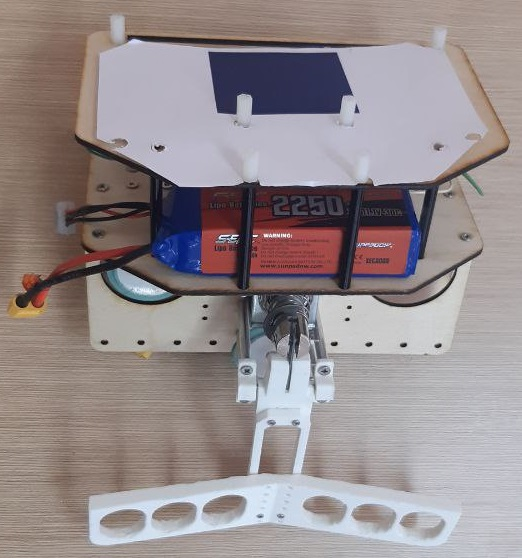

# Robotics-Arkanoid
opencv based code for robotics competitions in the Arkanoid nomination

use calibration.py to update settings and calibrate camera

vision.py - opencv and ball prediction

main.py - main logic

https://robofinist.ru/cabinet/events/robots/59434

